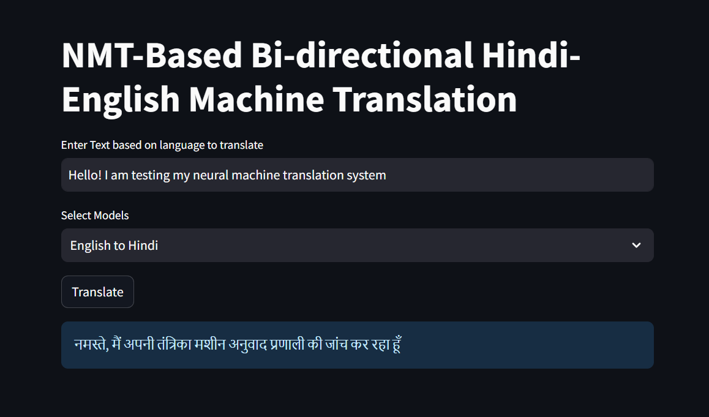
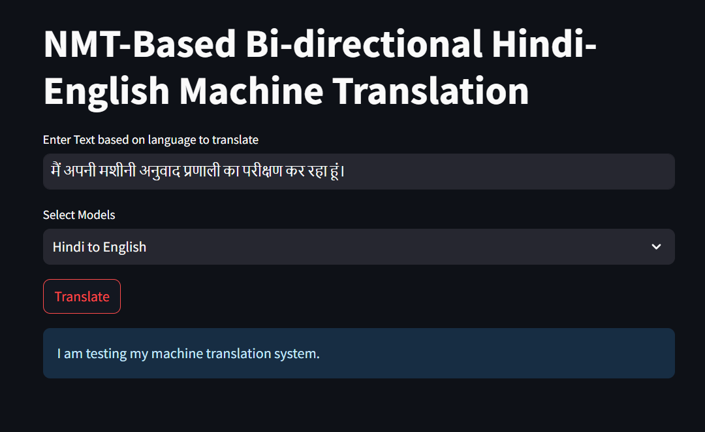
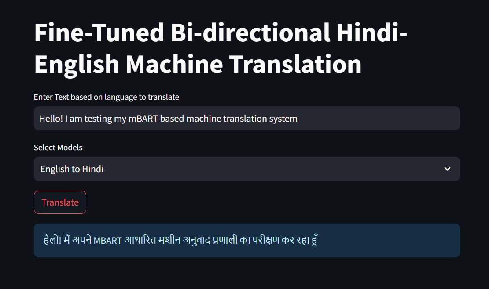

# Hindi <-> English Bidirectional Machine Translation

This Repository contains the training, and deployment code for Hindi-English Bidirectional MT Systems.

There are 2 MT Systems
    
    - Neural Machine Translation Based
    - Fine-Tuned LLMs/PLMs Models

## Neural Machine Translation System

This system was trained using Open-NMT with BPE as its tokenizer.\
The code for tokenisation can be found [here](commands).\
Number of merge operations is `30000`.\

### English to Hindi Neural Machine Translation System

### Hindi to English Neural Machine Translation System

### English to Hindi Fine-Tuned Machine Translation System

### Hindi to English Fine-Tuned Machine Translation System

To deploy the websites run 

`bash byte-pair-experiments/30k-merges/deploy.sh`

`bash LLMs/mBART/deployment/deploy.sh`

Note that models are translated using ctranslate2 and needs to be present before running the deployment script
